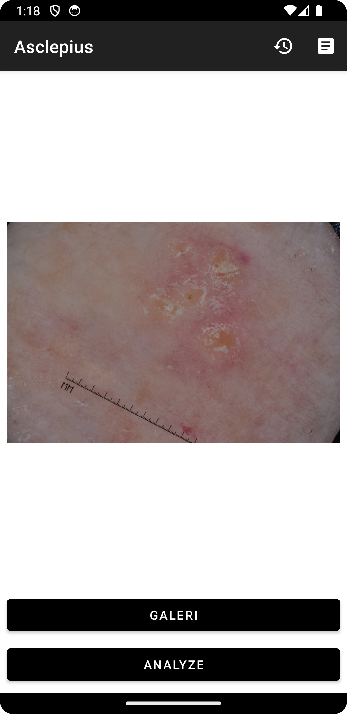
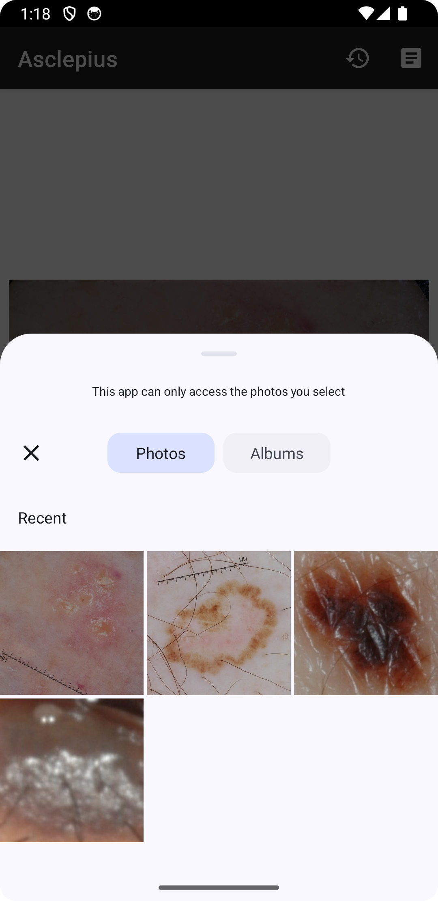
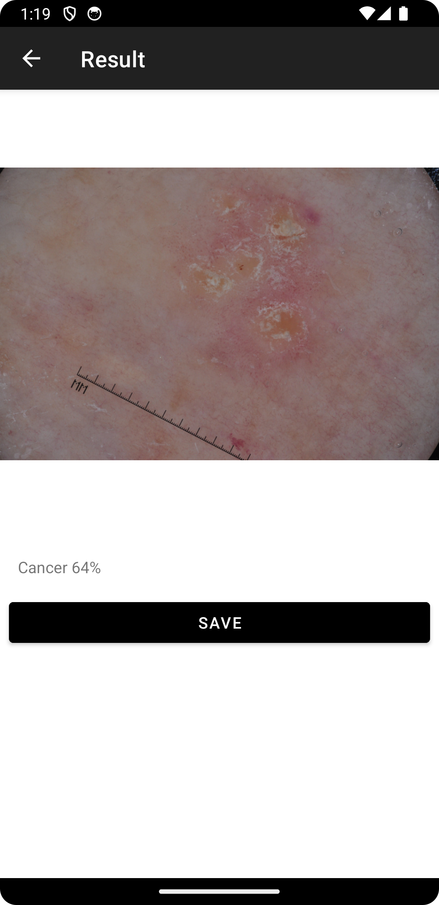
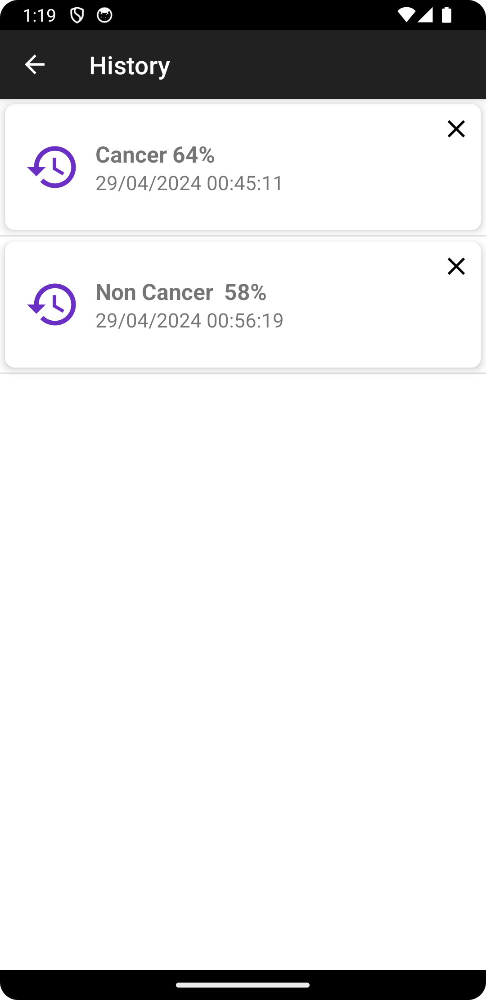
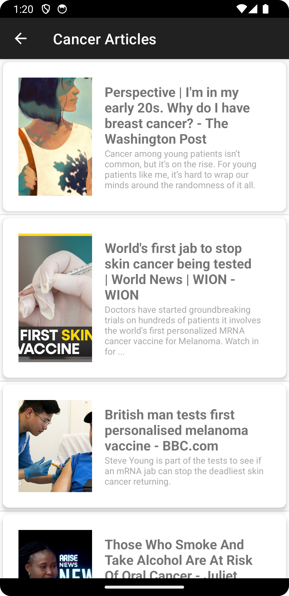

# Cancer Detection Application

## Description

The Cancer Detection Application is an Android app developed as the culminating project for the "Belajar Penerapan Machine Learning untuk Android" course by Dicoding. Built with Kotlin, It enables users to upload images and detects whether they contain cancer using a machine learning model. Additionally, it includes a feature to view the analysis history of user-uploaded images and provides articles about cancer from an external API.

**Note** : For learning purposes, not for plagiarism, following Dicoding's rules.

## Features
- **Image Upload**: Allows users to upload images for cancer detection.
- **Cancer Detection**: Utilizes a machine learning model to analyze uploaded images for cancer presence.
- **History**: Provides a history feature to view past image analysis results.
- **Article**: Offers articles about cancer fetched from an external API.

## Preview Application
| Home | Gallery | Result |
| --- | --- | --- |
|  |  |  |

| History | Article | 
| --- | --- |
|  |  |